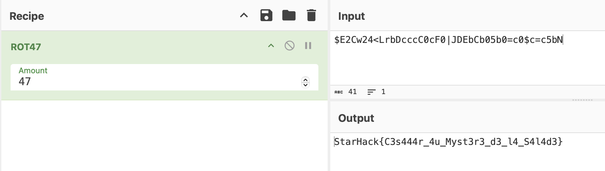

# Caesar, but not Caesar


## Challenge

### Description

> It’s a well-kept secret, but Caesar really loves salads. Who can decrypt it?
>
> `$E2Cw24<LrbDcccC0cF0|JDEbCb05b0=c0$c=c5bN`

## Solution

1. **Analyze the encrypted text:**

   The encrypted text is: `$E2Cw24<LrbDcccC0cF0|JDEbCb05b0=c0$c=c5bN`

2. **Convert to ASCII codes:**

   In Python, we can convert each character to its ASCII code:

   ```python
   cipher = "$E2Cw24<LrbDcccC0cF0|JDEbCb05b0=c0$c=c5bN"
   ascii_cipher = [ord(c) for c in cipher]
   print("ASCII values:", ascii_cipher)
   ```

3. **Hypothesis on the flag's beginning:**

   Knowing that the flag starts with `Star`, we can obtain the corresponding ASCII codes:

   ```python
   flag = "Star"
   ascii_flag = [ord(c) for c in flag]
   print("ASCII values of 'Star':", ascii_flag)
   ```

4. **Calculate the difference between ASCII values:**

   By comparing the ASCII values of the encrypted text and the assumed start of the flag:

   ```python
   start_cipher = "$E2C"
   ascii_start = [ord(c) for c in start_cipher]
   diff = [f - c for f, c in zip(ascii_flag, ascii_start)]
   print("Differences:", diff)
   ```

   The difference is a constant offset of 47.

5. **Reverse the shift to decrypt the text:**

   Applying a reverse shift of 47 to each character in the encrypted text with [Cyberchef](https://gchq.github.io/CyberChef/):


## Flag

The flag is `StarHack{C3s444r_4u_Myst3r3_d3_l4_S4l4d3}`.

---
